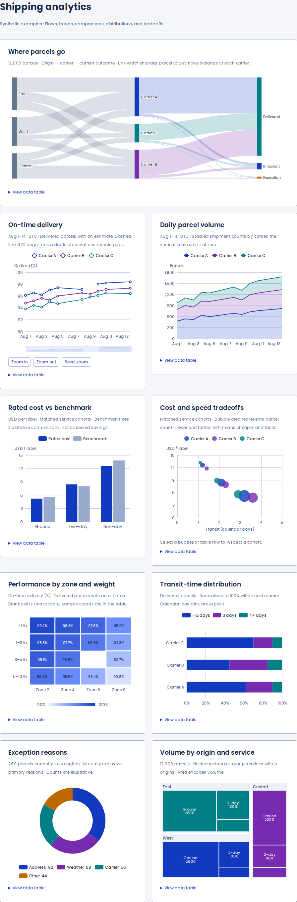
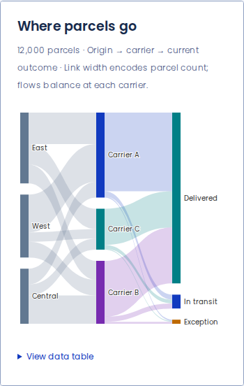
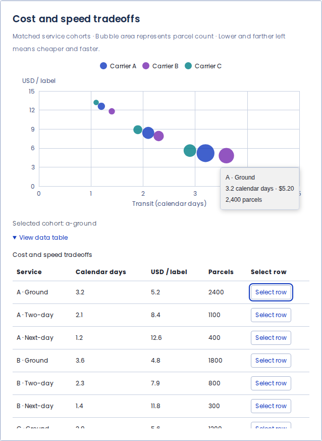

# Analytical chart examples

These are browser captures of Easy UI's actual Chart Storybook examples, using synthetic shipping records.

- Source: `a2bc53139f66bc6f4a45f3dbe8fa18a6a4f46e94`
- [Successful browser run](https://github.com/lanej/easy-ui/actions/runs/34701626760)
- [Source and regeneration instructions](../../../scripts/preview-metrics/README.md)
- `analytics-review.png` uses a 960 px viewport for readable embedding in PRs. The full mobile gallery uses 390 px; the workflow also verifies 1440 px desktop layouts.
- `validation.json` records nine charts at each tested layout, keyboard zoom, pointer selection, keyboard row selection, no horizontal overflow, no runtime errors, and nine canvas renderers.

The gallery includes Sankey, time series, area, grouped/stacked bars, scatter/bubble, heatmap, donut, and treemap. Charts and exact tables share their source records. KPI-only examples remain available in the adjacent `metrics` directory.

## Mobile Sankey

[Full mobile gallery](./analytics-mobile.png)

## Exact data and drill-down

After changing a component or example, regenerate the captures and validation record, and update the source/run references above.
