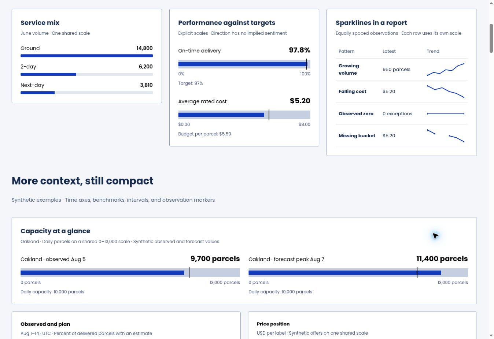
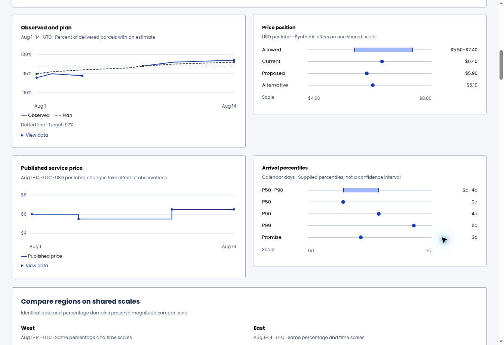

# Chart spacing and overflow review

Validated chart source: `ccc5c7507475b427b9bafa683f3634353ced05ab`.
Viewrule candidate: `351aa15c0c1db6baf9ec46fc9d4098555af95b85`
([engine PR #10](https://github.com/lanej/viewrule/pull/10)).

- [Live gallery](https://lanej.io/easy-ui/comparisons/)
- [280/320/480/720 px stress cards](https://lanej.io/easy-ui/comparisons/layout.html)
- [Final Viewrule run: 0 errors, 0 warnings](https://github.com/lanej/easy-ui/actions/runs/34762821209)
- [Report HTML/JSON and native-scale detail captures](https://github.com/lanej/easy-ui/actions/runs/34762821209/artifacts/10319736999)
- [Chrome, Firefox, Safari and full/modular captures](https://github.com/lanej/easy-ui/actions/runs/34762821241)
- [Package build, lint, tests, imports and Storybook](https://github.com/lanej/easy-ui/actions/runs/34762821212)

## Findings and repairs

| Finding                                                                                             | Repair                                                                                                                   |
| --------------------------------------------------------------------------------------------------- | ------------------------------------------------------------------------------------------------------------------------ |
| Card children absorbed spare height; headings and captions drifted apart                            | Group each example's content and stop stretching comparison cards                                                        |
| Wide range plots allocated proportional space to short labels                                       | Bound label/value columns and put tracks below the labels in narrow cards                                                |
| The report table stretched across the whole gallery                                                 | Group it with service mix and target comparisons; show three compact examples where space permits                        |
| Native time-series axes could clip large values or shrink independently below 160 px                | Wrap HTML axis labels and use the measured plot width without a 160 px floor                                             |
| 9–11 px annotations and table headers                                                               | Increase to a 12 px minimum; explanatory page prose remains at least 14 px                                               |
| SVG text collisions at axis corners, multiline labels, legends, scenario annotations and color keys | Add line height, separate ticks/titles, reserve narrow legend space, reposition annotations and separate the heatmap key |
| Safari test driver sent the string `ArrowRight`                                                     | Send the actual WebDriver arrow key; assert horizontal table scrolling                                                   |

The complete gallery is measured at 1440×1000, 320×844 and 3840×2160.
The long-content fixture also runs at desktop and 320 px. The shared browser
workflow checks a 280 px card with expanded tables, keyboard horizontal scrolling,
no page overflow, and matching native plot/axis heights in all three browsers.

## What Viewrule needed

The initial unmodified 14 px baseline reported 1,860 text observations across
three viewports, with no overflow/clipping findings. This was not 1,860 distinct
layout defects. The [application contract](../../../.ui-review/README.md)
explicitly calibrates dense annotations/captions/tables to 12 px and keeps page
prose/headings at 14 px. Counts before and after calibration are not a repairs-only
comparison; no human approval was invented.

The existing overlap measurement subsequently reported 64 warnings. Fixes brought
that to 12, then exposed three mobile axis-title groups as 10 pairwise warnings;
the final run has none. The overlap rule remains enabled. Its messages now include
both text excerpts so anonymous SVG `text` elements can be identified.

One new measurement was necessary: `within-bounds` compares HTML/SVG elements
with a declared containing ancestor. `no-clip` only measures an element's own
CSS clipping and cannot reliably catch SVG text outside the viewport.
Application scopes and thresholds stay in Easy UI; engine logic stays in Viewrule.

Passing geometry and axe checks do not certify arbitrary consumer chart options,
canvas label layout, clip paths/masks, occlusion, or semantic data correctness.
The original missing Chromatic project token still blocks that separate service;
this review does not configure or substitute for it.

## Captures

Live browser captures of source `ccc5c750`, at 1363×936 CSS pixels.
These show the ordinary desktop examples; the linked CI report retains
mobile/4K details and the deliberately constrained 280 px fixture.

