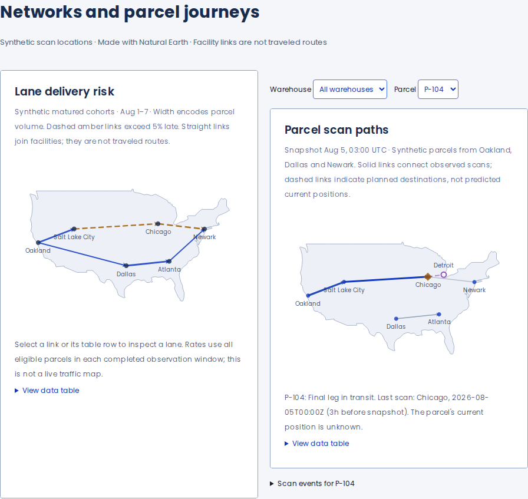
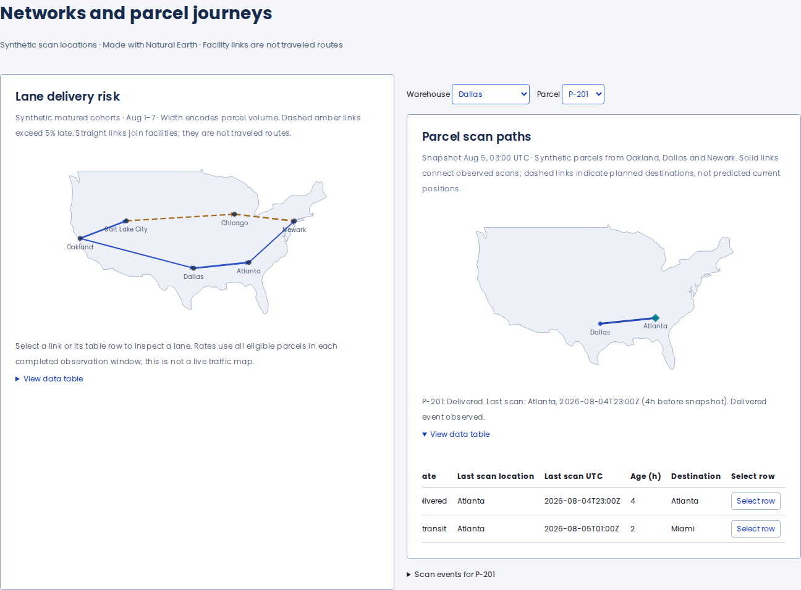
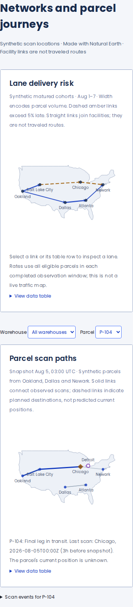

# Logistics intelligence and parcel tracking

Eight additive analytical recipes bring the portfolio to 26. Native capacity bullets also demonstrate observed volume and forecast overload without an analytical engine. All parcel, facility, rate and forecast records are synthetic.

| Recipe                       | Decision or task                                      | Evidence shown                                                                                                               |
| ---------------------------- | ----------------------------------------------------- | ---------------------------------------------------------------------------------------------------------------------------- |
| Delivery promise reliability | Compare carriers against a delivery promise           | Fully aged acceptance cohort, unresolved denominator, cumulative delivered counts, promise and service targets               |
| Rate competitiveness         | Find expensive or competitive zone/weight cohorts     | Signed price difference centered on parity, matched rates, sample counts, suppressed low-coverage cell                       |
| Price–volume response        | Compare price candidates and their contribution       | Supplied low/base/high volume scenarios, variable-cost assumption, proposed-price marker                                     |
| Capacity planning            | Identify overload and its timing                      | Observed versus forecast daily volume, advisory/limit bands, exact over-capacity counts                                      |
| Single-parcel timeline       | Explain dwell, movement and gaps                      | Scan-bounded intervals, unknown scan gap, observation cutoff, predicted arrival window and promise deadline                  |
| Multi-warehouse progress     | Compare the state of multiple parcels on one clock    | Acceptance-to-last-event spans, delivered state, stale scan gap, forecast windows and source warehouse                       |
| Lane map                     | Find lanes with elevated late-delivery rates          | Volume-weighted links, dashed risk threshold, exact rates and keyboard-selectable rows                                       |
| Parcel transit map           | Inspect one parcel or parcels from several warehouses | Warehouse/parcel filters, observed scan links, last-scan marker and age, planned destination and timestamped scan-event list |

## Actual browser captures

The images below come from the validated modular build. Full and modular builds render identically in the comparison run.

Lightweight capacity, warehouse filtering, and mobile maps

## Data meaning and loading

Unresolved parcels stay in reliability denominators. Suppressed rate cohorts stay missing. Pricing bands are supplied scenarios, not confidence intervals or measured causal lift. Forecast arrival windows are separate from observed events. Elapsed time is not percent complete. The transit map joins scan locations; it does not infer the parcel's current location between events. An expandable event list exposes every synthetic scan for the selected parcel.

The base modular registry still uses eight series types for the 24 non-geographic recipes. Opening the two maps dynamically registers GeoComponent and LinesChart and loads the local geographic data. A build assertion keeps those engine modules outside the non-map dependency closure, and browser capture verifies the map recipe is not requested before opening it. Timeline recipes use ordinary bar series. Geographic proportions are preserved across mobile and desktop layouts.

The basemap contains only the contiguous-US polygon from Natural Earth's public-domain 1:110m country data. The source blob is `1e6ab74c7042f97013be69ceec798be8e1aff27d`. No external map tiles or geocoding calls are made. [Fixture semantics, Storybook examples, and source/license links](../../../easy-ui-react/src/Chart/Chart.logistics.mdx).

These are recipes built on the existing public components. The published full-engine loader and ChartOption API are unchanged; the modular loader remains a preview experiment. The two previously documented zoom-refresh edge cases remain outside this addition. Figma matching still requires an approved design reference.

## Measured transfer

| Production output, gzip               |  Full ECharts | Modular portfolio |
| ------------------------------------- | ------------: | ----------------: |
| JavaScript for 24 recipes before maps | 515,654 bytes |     387,487 bytes |
| Additional JavaScript when maps open  |   5,100 bytes |      23,432 bytes |
| JavaScript for all 26 recipes         | 520,754 bytes |     410,919 bytes |
| CSS                                   |  11,016 bytes |      11,016 bytes |

The modular gallery saves 128.2 kB (24.9%) before maps, or 109.8 kB (21.1%) with maps. Maps add **23.4 kB gzip on demand** to the modular build. The full engine already contains geographic modules, so its incremental map chunk contains only recipes and data. Native capacity examples reuse BulletChart and add no analytical engine to the lightweight page.

[Exact sizes and measurement method](./bundle-sizes.json). These totals include React, Easy UI, tokens, fixtures, native components, lazy analytical dependencies, and the preview console recorder. Gzip is calculated per unique emitted asset; CSS is separate; fonts and state-only entry assets are excluded. The isolated engine probes in the JSON have a different measurement boundary: the 254.7 kB modular engine probe excludes geography. These results measure transfer cost, not rendering speed or dense-data performance.

## Validation

Validated source: `b9ef8f589428824103910654b80d3acc83b082c7`. GitHub validation merge: `f7298fae803d1b64001f1ae4f5573a3a0b152692`. This documentation commit publishes the captures and results from that source.

- [Package CI passed](https://github.com/lanej/easy-ui/actions/runs/34730077629): build, lint, Storybook, package import/server-rendering checks, and **657 unit tests passed, 2 skipped**. Thirteen logistics regressions cover real SVG rendering, data integrity, contrast, and responsive geographic proportions.
- [Browser workflow passed](https://github.com/lanej/easy-ui/actions/runs/34730077560): **105 exact PNG comparisons**, including all 26 plots in desktop/mobile SVG and desktop Canvas, original galleries, map filters, and keyboard/pointer interactions. Lightweight isolation and deferred map loading checks pass.
- **36 axe scans report zero violations**, with zero runtime warnings/errors across six browser/engine runs. Each run covers the gallery before maps, the geographic gallery, expanded tables, Canvas, state fixtures, and retry recovery.

| Browser                    | Full engine    | Modular engine |
| -------------------------- | -------------- | -------------- |
| Chrome 153.0.8010.36       | 6 scans passed | 6 scans passed |
| Firefox 155.0              | 6 scans passed | 6 scans passed |
| Apple Safari 26.6 on macOS | 6 scans passed | 6 scans passed |

Safari uses the actual Apple browser through `safaridriver`. Raw reports retain axe's incomplete SVG-background findings; no rules are disabled. Passing scans do not certify all WCAG criteria, screen-reader behavior, or arbitrary consumer options.

[Comparison results](./validation.json) · [Audit summary and limits](./audit-summary.json) · [Runnable builds and all captures](https://github.com/lanej/easy-ui/actions/runs/34730077560/artifacts/10308863978) · [Chrome reports](https://github.com/lanej/easy-ui/actions/runs/34730077560/artifacts/10309300259) · [Firefox reports](https://github.com/lanej/easy-ui/actions/runs/34730077560/artifacts/10308998737) · [Safari reports](https://github.com/lanej/easy-ui/actions/runs/34730077560/artifacts/10309310616).

[Build/capture commands](../../../scripts/preview-metrics/modular/README.md) · [Browser audit commands](../../../scripts/preview-metrics/audit/README.md).
