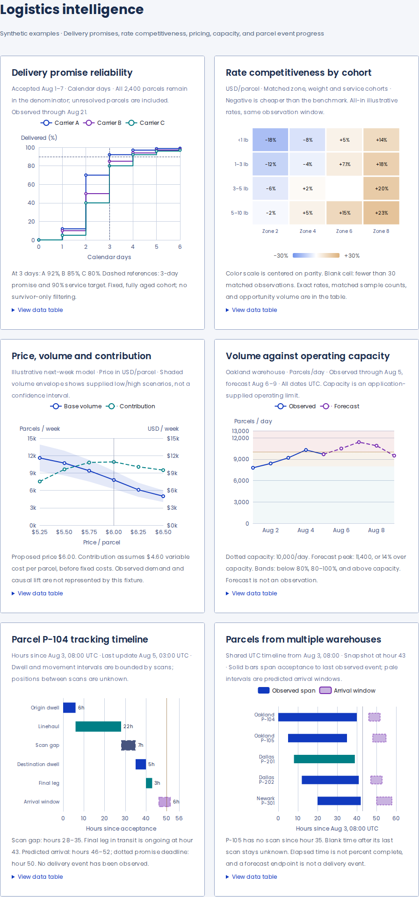
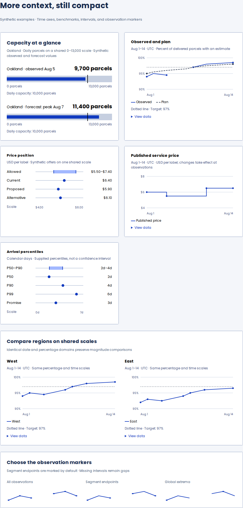

# Logistics intelligence and parcel progress

Six additive analytical recipes bring the chart portfolio to 24. Native capacity bullets also demonstrate observed volume and forecast overload without an analytical engine. All parcel, facility, rate and forecast records are synthetic.

Mapping is now a separate draft workstream. The earlier lane and transit maps are preserved there as a reference prototype, pending replacement with a dedicated mapping experience. [Network mapping scope](https://github.com/lanej/easy-ui/blob/feat/network-intelligence-maps/documentation/specs/NetworkMaps.md).

| Recipe                       | Decision or task                                   | Evidence shown                                                                                                 |
| ---------------------------- | -------------------------------------------------- | -------------------------------------------------------------------------------------------------------------- |
| Delivery promise reliability | Compare carriers against a delivery promise        | Fully aged acceptance cohort, unresolved denominator, cumulative delivered counts, promise and service targets |
| Rate competitiveness         | Find expensive or competitive zone/weight cohorts  | Signed price difference centered on parity, matched rates, sample counts, suppressed low-coverage cell         |
| Price–volume response        | Compare price candidates and their contribution    | Supplied low/base/high volume scenarios, variable-cost assumption, proposed-price marker                       |
| Capacity planning            | Identify overload and its timing                   | Observed versus forecast daily volume, advisory/limit bands, exact over-capacity counts                        |
| Single-parcel timeline       | Explain dwell, movement and gaps                   | Scan-bounded intervals, unknown scan gap, observation cutoff, predicted arrival window and promise deadline    |
| Multi-warehouse progress     | Compare the state of multiple parcels on one clock | Acceptance-to-last-event spans, delivered state, stale scan gap, forecast windows and source warehouse         |

## Actual browser captures

These retained captures show the six logistics recipes and native portfolio from source `b9ef8f589428824103910654b80d3acc83b082c7`, before the mapping extraction. Their chart fixtures are unchanged by the extraction.

## Data meaning

Unresolved parcels stay in reliability denominators. Suppressed rate cohorts stay missing. Pricing bands are supplied scenarios, not confidence intervals or measured causal lift. Forecast arrival windows are separate from observed events. Elapsed time is not percent complete. Missing scan intervals stay unknown.

The modular registry uses eight series types for all 24 recipes. Timeline recipes use ordinary bar series. A build assertion excludes geographic chart modules and the full ECharts entry from the modular build. The published full-engine loader and ChartOption API are unchanged; modular loading remains a preview experiment.

[Fixture semantics and Storybook examples](../../../easy-ui-react/src/Chart/Chart.logistics.mdx). The two previously documented zoom-refresh edge cases remain outside this addition. Figma matching still requires an approved design reference.

## Validation provenance

The checked-in measurement, comparison and audit JSON files currently retain the earlier combined 26-recipe source and must not be reported as the extracted 24-recipe build. That source passed 657 tests, 105 screenshot comparisons and 36 axe scans. The extraction's CI and measurements are being collected separately for the PR update.

[Earlier exact measurements](./bundle-sizes.json) · [Earlier comparison results](./validation.json) · [Earlier audit summary](./audit-summary.json).

[Build/capture commands](../../../scripts/preview-metrics/modular/README.md) · [Browser audit commands](../../../scripts/preview-metrics/audit/README.md).
