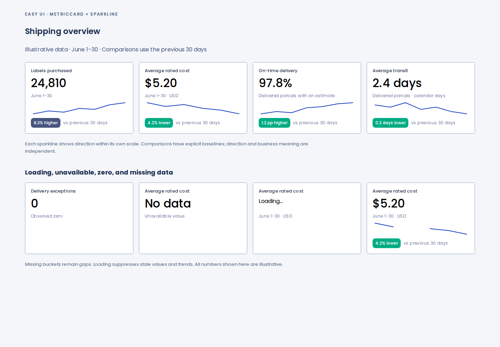
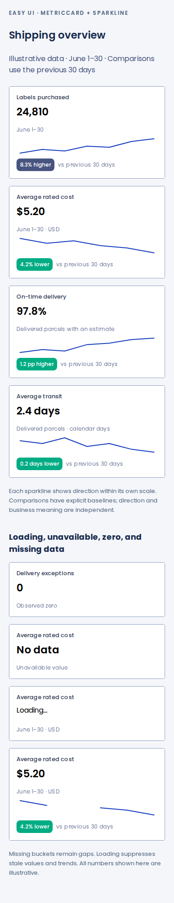

# MetricCard and Sparkline examples

These captures render the actual components and the ShippingOverview Storybook example with synthetic shipping data. Desktop is 1440 px wide; mobile is 390 px wide.

- Source commit: `a331a5ce83d7651cb1a221d85a6a492321f16db1`
- [Successful capture run](https://github.com/lanej/easy-ui/actions/runs/34698741730)
- [Preview source and regeneration instructions](../../../scripts/preview-metrics/README.md)

The isolated preview uses published Easy UI tokens `1.0.0-alpha.17`. The capture checks four overview trends, no horizontal overflow, and no browser errors at both widths; `validation.json` records those results. Full package and Storybook validation runs separately in CI.

Mobile example

After a component or example changes, regenerate the captures, replace the PNGs and validation record here, and update the source commit and run link above.
