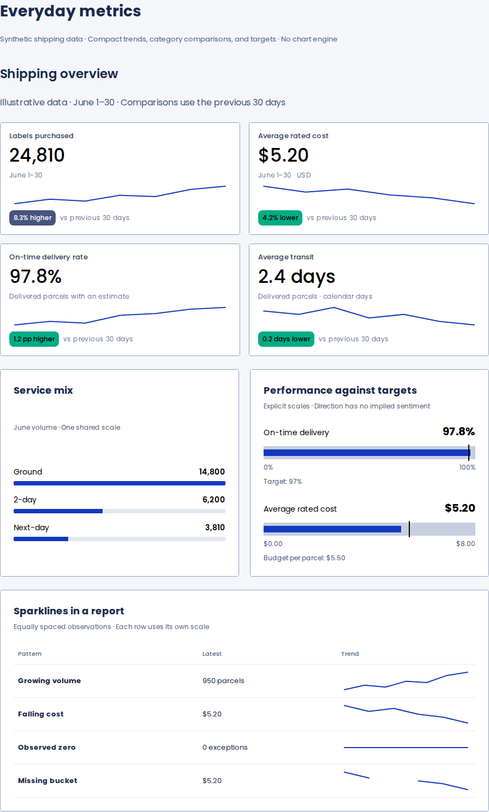
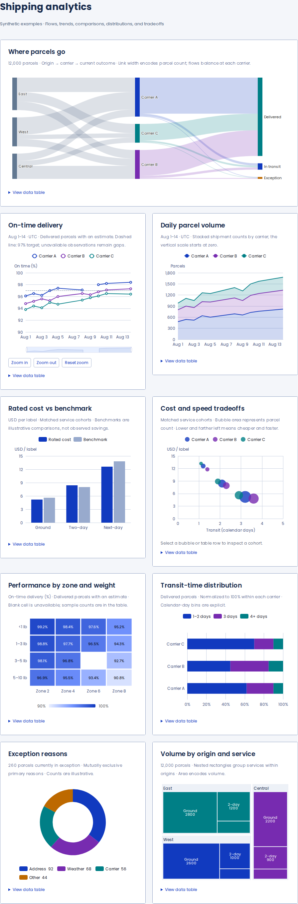
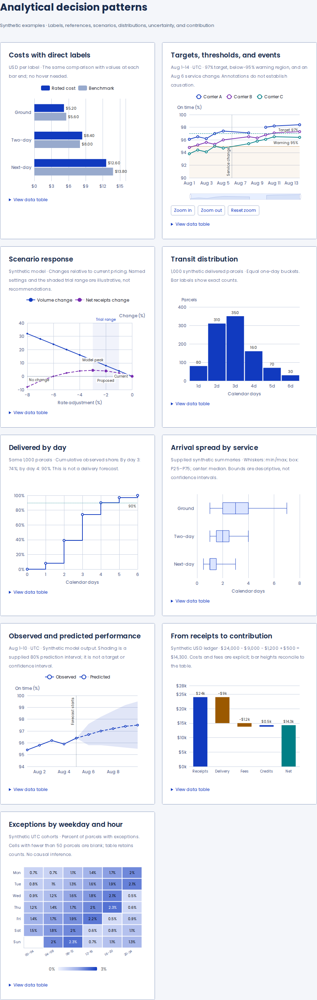
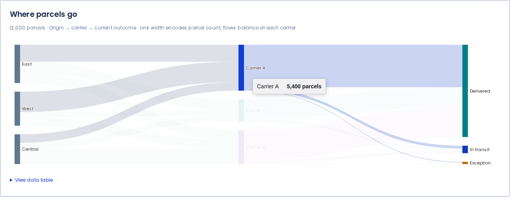
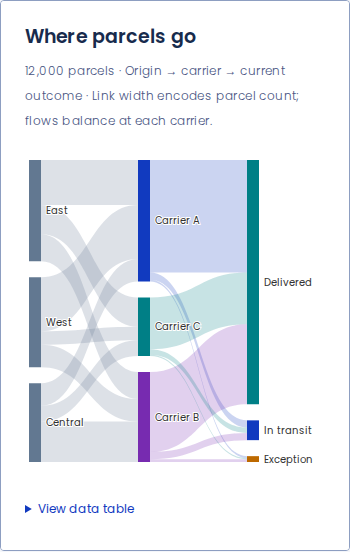

# Modular ECharts assessment

Retain ECharts and offer modular loading as an explicit optimization. This experiment removes unused modules while keeping the existing 18 analytical recipes, SVG and Canvas, Sankey adjacency emphasis, labels, targets, thresholds, and exact-value tables. All six native components remain available. The checklist follow-up also improves KPI and heatmap text contrast, distinguishes table regions, and completes public TSDoc.

The original Recharts comparison is [closed in #3](https://github.com/lanej/easy-ui/pull/3): its smaller bundle did not justify the specialized chart maintenance and feature gaps. This experiment is [PR #4](https://github.com/lanej/easy-ui/pull/4), based directly on [#1](https://github.com/lanej/easy-ui/pull/1).

## Measured transfer

| Production output                 | Full ECharts | Modular portfolio |           Saving |
| --------------------------------- | -----------: | ----------------: | ---------------: |
| Complete gallery, gzip JavaScript |     504.5 kB |          377.0 kB | 127.4 kB (25.3%) |
| Gallery's lazy engine chunk, gzip |     382.2 kB |          254.7 kB | 127.4 kB (33.3%) |
| Gallery CSS, gzip                 |      10.8 kB |           10.8 kB |                — |

A separate SVG time-series engine probe measures 203.1 kB gzip. It includes line charts, legends, tooltips, zoom, annotations, and label layout, but cannot render the complete portfolio. This is a size probe, not a tested replacement for the gallery.

[Exact asset sizes and measurement method](./bundle-sizes.json). Totals include React, Easy UI, tokens, fixtures, all native components, and all lazy analytical dependencies. Gzip is calculated per unique emitted asset. CSS is separate; fonts are excluded. The JSON also includes isolated `init`-only engine exports: the full export is 379.0 kB there because it retains fewer public exports than the gallery's dynamic namespace import. Do not mix those two measurements.

The original gallery contains different UI from the earlier Recharts comparison page; compare full and modular values from this build. These measurements establish a transfer saving, not faster rendering or dense-data performance. The six native components measure 16.9 kB gzip with React, global styles, tokens, fonts, and application fixtures excluded; see [native measurements](./native-bundle-sizes.json). Current gallery totals include the preview console recorder and the shared chunks produced by adding the audit-state entry. State-only entry assets are excluded from the gallery dependency closure.

## Rendered examples

These are actual modular-build captures of the original synthetic fixtures. The full build is checked against the same images.

Sankey emphasis and mobile flow

## What is included

| Layer        | Registered capabilities                                                                                                     |
| ------------ | --------------------------------------------------------------------------------------------------------------------------- |
| Series       | Line, bar, scatter, pie, Sankey, treemap, heatmap, boxplot                                                                  |
| Compositions | Area, grouped/stacked bars, scenarios, histogram, cumulative distribution, supplied prediction band, contribution waterfall |
| Components   | Cartesian grid, legends, tooltips, inside/slider zoom, mark lines/areas/points, continuous visual map                       |
| Rendering    | SVG and Canvas, label layout, legacy grid `containLabel` support                                                            |
| Easy UI      | Existing frame, statuses, exact tables, row selection and keyboard zoom; all six native components                          |

Registration follows the full engine’s order. The comparison exposed a three-pixel difference at an overlapping scenario marker when marker modules were registered in a different order.

A modular registry only supports what it registers. Geo/maps, radar, gauges, graphs, calendar, timeline, toolbox, dataset transforms, piecewise visual maps, ARIA decals, and universal transitions require additional modules. Those omissions do not affect these fixtures, but matter for applications using the unrestricted `ChartOption` API.

## Recommended API direction

Prefer one broad analytical preset initially: narrowing it to the time-series probe saves only about another 52 kB and loses much of the portfolio.

Keep the full entry available and add an explicit modular entry or an application-supplied loader, with a narrower `ComposeOption` type. Verify a consumer production build excludes the default full engine when that entry is selected. Registry modules are global to an ECharts runtime; importing the full engine anywhere in the same page removes the expected size benefit and can conceal missing registrations.

This draft substitutes the loader only inside the preview build. The existing engine API and all examples are retained. The two known zoom-refresh edge cases in #1 remain wrapper bugs under both loading strategies and need a separate fix before adoption.

## Validation and reproduction

**All 74 PNG comparisons passed**, and both builds passed the original interaction checks with no runtime console warnings or errors. [Browser workflow](https://github.com/lanej/easy-ui/actions/runs/34727396947) · [Full package CI](https://github.com/lanej/easy-ui/actions/runs/34727396954) · [Runnable builds and all captures](https://github.com/lanej/easy-ui/actions/runs/34727396947/artifacts/10307824897).

Validated source head: `0c1d284571a016613169188f74a74039773e2dcf`. GitHub’s validation merge commit is `00757957a2e5fa5ebf0d496cecab72364c8d3329`. This documentation commit only publishes the results, captures, and audit guidance. Full CI passed build, lint, Storybook, package import/server-rendering checks, and 644 unit tests (2 skipped).

Validation results and source provenance are recorded in [validation.json](./validation.json). The comparison uses independent builds and fresh browser processes, exercises the existing desktop/mobile pointer, keyboard, overflow and lightweight-isolation checks, and compares exact PNG bytes for the original galleries, all 18 plots in desktop/mobile SVG and desktop Canvas, signed waterfall tooltips, exact-table selection, and Sankey emphasis.

Run `npm ci`, `npm run measure:modular`, and `npm run capture:modular` from `scripts/preview-metrics` after installing Playwright Chromium. Outputs are `dist/modular/full/`, `dist/modular/portfolio/`, `dist/modular/bundle-sizes.json`, and `screenshots/modular/`. Both sites retain the original gallery, `?renderer=canvas`, and `?portfolio=lightweight`.

[Registry and detailed reproduction notes](../../../scripts/preview-metrics/modular/README.md).

## Checklist remediation

Completed TSDoc for the seven public components and their types/props; the source audit covered 113 declarations and properties with no missing comments. Positive KPI comparison text now uses neutral 900 on positive 600 (7.23:1 contrast). Heatmap labels use black or white, with a regression checking every cell against the renderer's actual color interpolation. Compact time-series table regions include their figure label; example metric regions also have distinct names.

| Browser                     | Full engine        | Modular engine     | Runtime warnings/errors |
| --------------------------- | ------------------ | ------------------ | ----------------------- |
| Google Chrome 153.0.8010.36 | 5 axe scans passed | 5 axe scans passed | 0                       |
| Firefox 155.0               | 5 axe scans passed | 5 axe scans passed | 0                       |
| Apple Safari 26.6 on macOS  | 5 axe scans passed | 5 axe scans passed | 0                       |

The 30 scans cover the gallery, all expanded tables, Canvas, loading/empty/error/partial states, and retry recovery. The three browsers also pass keyboard zoom, row selection, disclosure, and retry checks. Safari uses the actual Apple browser through `safaridriver`. [Recorded results and review boundaries](./audit-summary.json) · [Audit commands and scope](../../../scripts/preview-metrics/audit/README.md).

Raw reports preserve axe's `incomplete` SVG-background findings; no rules are disabled. The heatmap regression and review of neutral axis/text tokens and white treemap labels supplement those findings. Passing scans establish zero reported violations in these fixtures, not certification of all WCAG criteria or arbitrary consumer options. Screen-reader certification has not been performed.

Download the reports and browser screenshots: [Chrome](https://github.com/lanej/easy-ui/actions/runs/34727396947/artifacts/10307924553), [Firefox](https://github.com/lanej/easy-ui/actions/runs/34727396947/artifacts/10308390540), [Safari](https://github.com/lanej/easy-ui/actions/runs/34727396947/artifacts/10307709949).

**Figma design matching remains unchecked:** no chart-specific Figma file or node was supplied or found. Pixel parity between engine builds does not establish agreement with a design specification.
