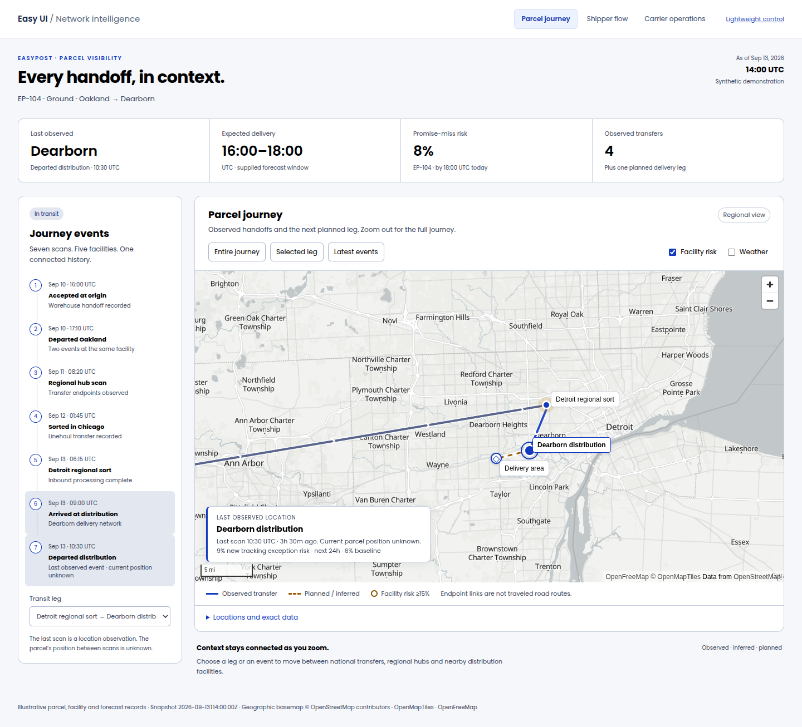
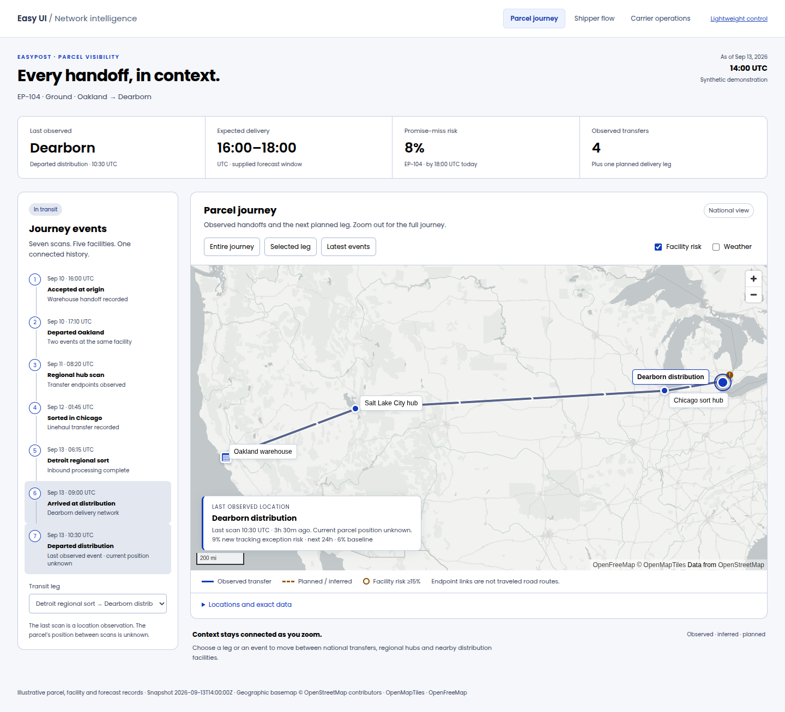
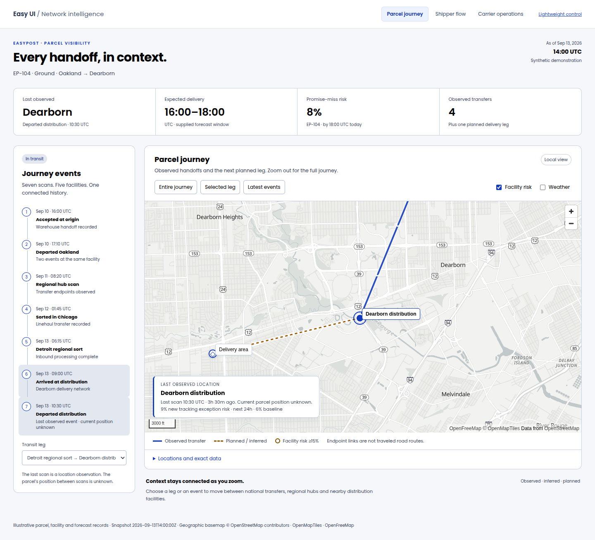
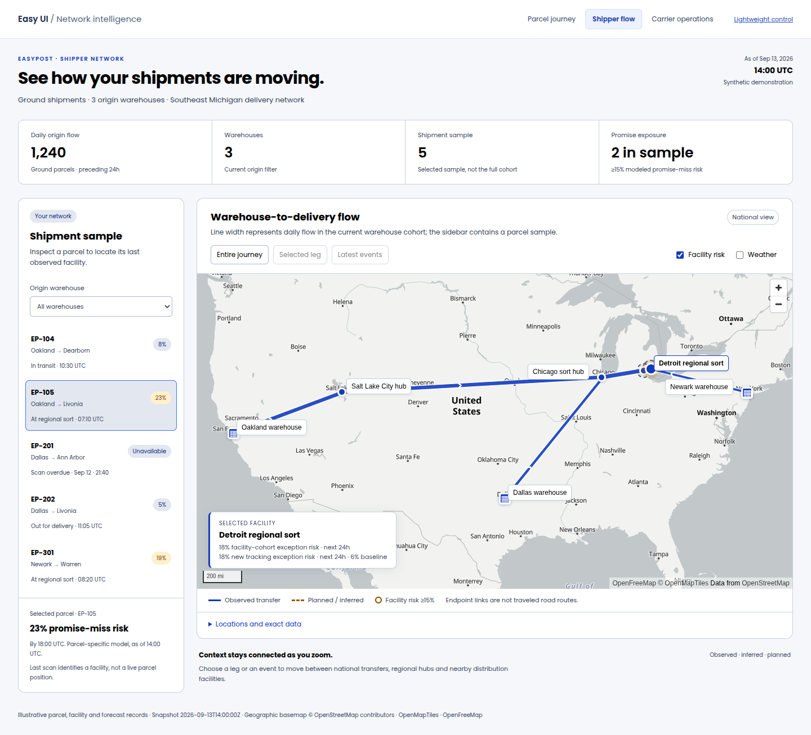
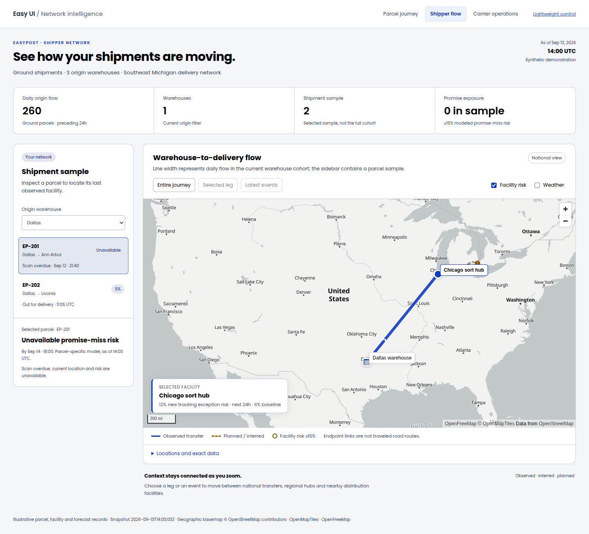
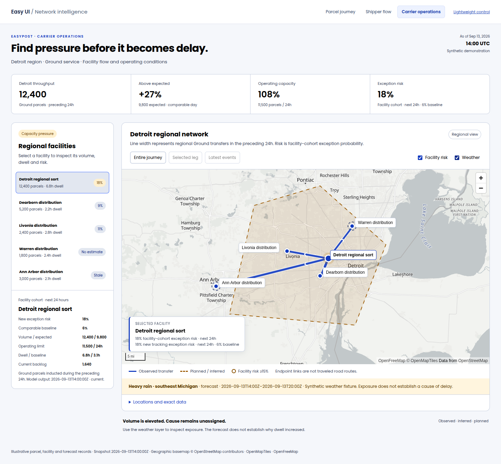
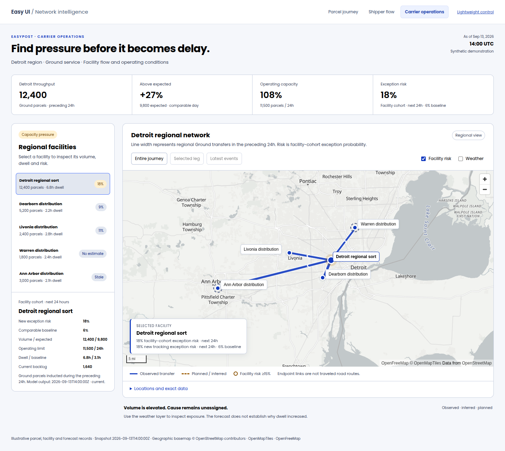
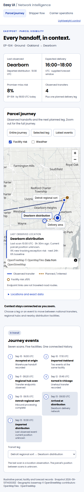
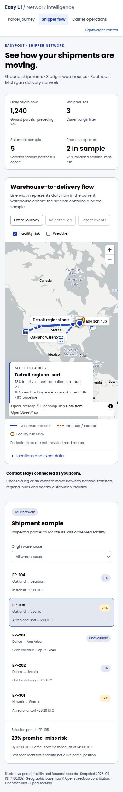
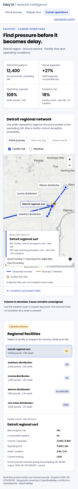

# Network intelligence maps

[Draft PR #5](https://github.com/lanej/easy-ui/pull/5) is the top of the draft stack [#1](https://github.com/lanej/easy-ui/pull/1) → [#4](https://github.com/lanej/easy-ui/pull/4) → [#5](https://github.com/lanej/easy-ui/pull/5) and implements the optional MapLibre `NetworkMap` entry. [Chart PR #4](https://github.com/lanej/easy-ui/pull/4) retains 24 analytical recipes and six native components; maps have their own runtime, stories and review harness.

[Live map gallery](https://lanej.io/easy-ui/network-maps/maps/) · [Storybook](https://lanej.io/easy-ui/network-maps/storybook/?path=/story/components-networkmap--parcel-journey) · [NetworkMap API](https://lanej.io/easy-ui/network-maps/api/types/NetworkMap.NetworkMapProps.html)

## Investigations

| Example            | What to try                                                                         | Evidence                                                                                                                 |
| ------------------ | ----------------------------------------------------------------------------------- | ------------------------------------------------------------------------------------------------------------------------ |
| Parcel journey     | Fit the national journey, select a regional leg, focus the latest distribution scan | Seven scans, five observed facilities, four observed transfers, a planned delivery leg, scan age and parcel promise risk |
| Shipper flow       | Filter by warehouse, inspect a sampled parcel, select a facility                    | Full-cohort daily flow and relative widths, separately scoped parcel sample, parcel promise risk                         |
| Carrier operations | Select a regional facility and toggle risk/weather                                  | Throughput against expected volume/capacity, dwell, backlog, facility-cohort exception risk, forecast interval/source    |

Real OpenFreeMap vector tiles provide national geography and local streets. Selected/last-observed labels receive priority; local facilities appear as the camera zooms in. Data and layer updates preserve manual camera movement. Repeated scans share facility identifiers and markers.

The examples use synthetic records as of September 13, 2026, 14:00 UTC. Risk is caller-supplied model output. Facility cohort risk is not an individual parcel's promise risk. Forecast weather indicates exposure, not the cause of a delay. The last scan is an observation; current parcel position between scans remains unknown. Endpoint links do not establish a traveled road route.

## Browser examples and evidence

Captured from `ad0ceb1b3e37b42a055664b308630afd145125f2` (GitHub's tested PR merge `92014aa155c0b8487e7598b89ccbcc420eb812f5`), September 13, 2026. [Chrome / Firefox / Safari workflow](https://github.com/lanej/easy-ui/actions/runs/34739063304) passes 35 checks and 10 axe scans per browser, with zero reported accessibility violations. The three desktop investigation flows report no console warnings or errors. The screenshots below are actual Chrome renders of synthetic records.

### Parcel journey — regional handoffs

National journey and local distribution streets

### Shipper — multi-warehouse flow

Filter to the Dallas warehouse cohort

### Carrier — facility risk and weather exposure

Facility network with weather disabled

All three investigations at 390px

| Parcel | Shipper | Carrier |
| --- | --- | --- |
|  |  |  |

### Validation and loading cost

[Validation summary](validation.json) · [Chrome report](chrome-report.json) · [Firefox report](firefox-report.json) · [Safari report](safari-report.json) · [Production assets](bundle-report.json). The workflow artifacts include all 30 browser captures and full axe results. Chrome and Firefox check 390px layouts; Safari uses its actual minimum window width. Package CI verifies build, lint, unit tests, Storybook and CommonJS/ESM server rendering.

| Production consumer payload | Gzip bytes |
| --- | ---: |
| MapLibre main engine | 288,891 |
| Separately emitted module worker | 147,882 |
| Engine plus worker | 436,773 |
| Complete map gallery JavaScript, including React, theme, examples and worker | 510,948 |
| Complete map gallery CSS | 19,016 |
| Native SVG control JavaScript, including React and theme | 63,328 |

These are per-asset gzip build sizes, not measured total session transfer. Fonts, basemap styles, sprites, glyphs and viewport-dependent tiles load separately. The engine and worker bundles duplicate some shared code in this Vite integration. The native SVG control loads no MapLibre engine, worker, map CSS or basemap requests. Easy UI's published global stylesheet still includes the small component wrapper styles.

## Run and integrate

See the [independent harness](../../../scripts/preview-maps/README.md), [component documentation](../../../easy-ui-react/src/NetworkMap/NetworkMap.mdx), [public TSDoc types](../../../easy-ui-react/src/NetworkMap/types.ts) and [scope/specification](../../specs/NetworkMaps.md).

Install the optional `maplibre-gl` peer, import its CSS in the consuming map route, and supply the URL of the bundled module worker as `workerUrl`. Use the application's normal Easy UI stylesheet and ThemeProvider. Applications supply their own MapLibre style, including provider attribution and service terms. The examples use a public keyless OpenFreeMap style; production availability and tile terms remain application choices.

The production harness measures lazy engine and complete consumer asset closures separately. It verifies that an independent native SVG entry loads no map code, CSS or basemap resources. The emitted module worker is counted separately and included in total map JavaScript; styles, tiles, sprites and glyphs are separate network requests. Main-page Resource Timing does not include every worker tile request, and cross-origin sizes can be unavailable; missing sizes are recorded as null. The request report is diagnostic, not a complete transfer total.

## Review limits

This is a UI component and fixture portfolio. Live event/model/weather feeds, time playback, server-side authorization and querying, high-density clustering, model uncertainty and target-hardware memory/latency budgets remain follow-on work. An approved Figma reference is still needed for design sign-off. Automated accessibility scans do not certify all screen-reader or WCAG behavior.

The previous ECharts map prototype is available in [its immutable documentation commit](https://github.com/lanej/easy-ui/blob/043a9332b3af26653e46e842951105866740e162/documentation/examples/logistics/README.md). Its 23.4 kB incremental figure does not describe this MapLibre implementation.
